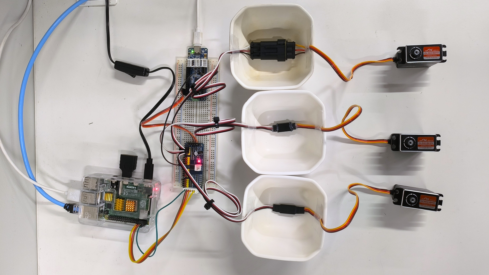

# Servo Logger — サーボ制御 + PWM計測 + Web UI

Raspberry Pi + OpenRB-150 + PCA9685 を使ったサーボ制御・PWMパルス幅計測・リアルタイムWebビューアシステムです。

---

## システム構成

```
手元PC (ブラウザ)
    ↕ HTTP / WebSocket
Raspberry Pi
    ├── app.py          Webサーバー (Flask + SocketIO)
    ├── camera.py       タイムラプス撮影 (OpenCV)
    ├── templates/
    │   ├── index.html  メインUI
    │   └── replay.html 再生ビューア
    ↕ I2C (SDA/SCL)
PCA9685 (0x41)
    ├── ch0 → サーボ0
    ├── ch1 → サーボ1
    └── ch2 → サーボ2
    ↕ USB シリアル (115200bps)
OpenRB-150
    └── openrb_pulsein.ino
        ├── D3 → サーボch0 PWM計測
        ├── D4 → サーボch1 PWM計測
        └── D5 → サーボch2 PWM計測
    ↕ USB
USBカメラ → Raspberry Pi
```

---

## ファイル構成

```
servo_project/
├── app.py                      # Flask Webサーバー（メイン）
├── camera.py                   # タイムラプス撮影モジュール
├── README.md
├── templates/
│   ├── index.html              # メインUI（サーボ制御・リアルタイムグラフ）
│   └── replay.html             # セッション再生ビューア
├── openrb_pulsein.ino          # OpenRB-150 PWM計測スケッチ（現行）
├── logs/                       # セッションデータ保存先（自動生成・gitignore）
│   └── session_YYYYMMDD_HHMMSS/
│       ├── data.csv            # パルス幅・角度データ
│       ├── frames.json         # フレームログ
│       └── frame_XXXXXX.jpg   # タイムラプス画像
└── archive/                    # 旧ファイル（参考用）
    ├── serial_logger.py        # シリアル受信 + CSV（旧版）
    ├── servo_control.py        # サーボ単体制御（旧版）
    ├── servo_with_logging.py   # サーボ + INA226ロギング（旧版）
    ├── ina226_logger.py        # INA226電圧・電流ロガー（旧版）
    └── setup_servo_env.sh      # 仮想環境構築スクリプト（旧版）
```

---

## 配線



> 画像ファイルは `img/` フォルダに配置してください。ファイル名が異なる場合は上記のパスを変更してください。

### PCA9685（I2Cアドレス: 0x41）

| Raspberry Pi      | PCA9685  | 備考               |
|-------------------|----------|--------------------|
| Pin 1 (3.3V)      | VCC      | 制御電源           |
| Pin 6 (GND)       | GND      |                    |
| Pin 3 (GPIO2/SDA) | SDA      |                    |
| Pin 5 (GPIO3/SCL) | SCL      |                    |
| 外部電源 5〜6V    | V+       | サーボ駆動電源     |

> ⚠️ PCA9685 の VCC は 3.3V、V+（サーボ駆動）は外部電源 5〜6V を使用してください。

### OpenRB-150（PWM計測）

| PCA9685 信号ピン | OpenRB ピン | 対応サーボ |
|-----------------|------------|-----------|
| ch0 信号        | D3         | サーボ0   |
| ch1 信号        | D4         | サーボ1   |
| ch2 信号        | D5         | サーボ2   |
| GND             | GND        | 共通GND   |

> ⚠️ PCA9685 VCC が 3.3V の場合、信号線の分圧は不要です。

---

## セットアップ

### 1. Raspberry Pi の I2C 有効化

```bash
sudo raspi-config
# Interface Options → I2C → Enable → 再起動
```

### 2. 仮想環境構築

```bash
mkdir ~/servo_project
cd ~/servo_project
chmod +x setup_servo_env.sh
./setup_servo_env.sh

# 追加パッケージ
source ~/servo_env/bin/activate
pip install flask flask-socketio pyserial smbus2 opencv-python-headless
```

### 3. OpenRB-150 へスケッチ書き込み

Arduino IDE で `openrb_pulsein.ino` を書き込みます。

ボード設定:
- Board: `OpenRB-150`
- ボーレート: 115200bps

### 4. Webサーバー起動

```bash
cd ~/servo_project
source ~/servo_env/bin/activate
python3 app.py
```

### 5. ブラウザでアクセス

```
http://<RaspberryPiのIPアドレス>:5000
```

IPアドレスの確認: `hostname -I`

---

## 使い方

### メインUI (`/`)

| 機能 | 操作 |
|------|------|
| サーボ ON/OFF | 各チャンネルの `SRV ON/OFF` ボタン |
| 角度指定 | スライダーをドラッグ |
| 全チャンネル制御 | `ALL SRV ON/OFF` ボタン |
| 自動スイープ | 片道秒数を入力して `SWEEP` ボタン |
| 計測開始/停止 | `▶ START` / `■ STOP` ボタン |
| CSVダウンロード | `⬇ CSV` ボタン |
| 再生ビューア | `⏵ REPLAY` ボタン |

### 再生ビューア (`/replay`)

保存済みセッションを選択して `Load` → `▶ Play` で再生します。タイムラインスライダーで任意の時刻にシークできます。

---

## シリアル通信仕様

### OpenRB → Raspberry Pi（データ送信）

```
フォーマット: timestamp_ms,pulse_ch0,pulse_ch1,pulse_ch2
例: 1000,1500,1502,1498
```

| フィールド | 説明 |
|-----------|------|
| timestamp_ms | 計測開始からの経過時間 [ms] |
| pulse_ch0〜2 | 各チャンネルのパルス幅 [μs] (500〜2500) |

### Raspberry Pi → OpenRB（コマンド送信）

| コマンド | 動作 |
|---------|------|
| `s` | 計測開始 |
| `p` | 計測停止 |
| `r` | リセット |

---

## CSV データ形式

```csv
recv_time,timestamp_ms,pulse_ch0,pulse_ch1,pulse_ch2,angle_ch0,angle_ch1,angle_ch2
2026-03-11T18:28:30.123,1000,1500,1502,1498,90.0,90.2,89.8
```

| カラム | 説明 |
|-------|------|
| recv_time | Raspberry Pi 受信時刻 (ISO8601) |
| timestamp_ms | OpenRB 計測タイムスタンプ [ms] |
| pulse_ch0〜2 | パルス幅 [μs] |
| angle_ch0〜2 | 推定角度 [度] |

---

## PCA9685 I2C アドレス設定

| A0 | A1 | A2 | A3 | A4 | A5 | アドレス |
|----|----|----|----|----|-----|---------|
| 0  | 0  | 0  | 0  | 0  | 0   | 0x40    |
| 1  | 0  | 0  | 0  | 0  | 0   | 0x41 ← 今回 |

`app.py` の `PCA_ADDR = 0x41` を変更することでアドレスを変更できます。

---

## トラブルシューティング

| 症状 | 対処法 |
|------|--------|
| ブラウザに繋がらない | `python3 app.py` が起動しているか確認 |
| サーボが動かない | `SERVO ON` ボタンを押したか確認・V+ 外部電源を確認 |
| グラフが表示されない | ブラウザをリロード（キャッシュクリア） |
| シリアル接続失敗 | `/dev/ttyACM0` を確認: `ls /dev/tty*` |
| パルス値が 0 | OpenRB と PCA9685 の配線（D3/D4/D5）を確認 |
| `OSError: [Errno 121]` | I2C 配線・アドレス確認: `i2cdetect -y 1` |
| カメラが認識されない | `ls /dev/video*` でデバイスを確認 |